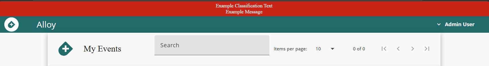

# Alloy Helm Chart

[Alloy](https://cmu-sei.github.io/crucible/alloy/) is the [Crucible](https://cmu-sei.github.io/crucible/) application that enables users to launch on-demand events or join instances of already-running simulations.

This Helm chart deploys Alloy with both [API](https://github.com/cmu-sei/Alloy.Api) and [UI](https://github.com/cmu-sei/Alloy.Ui) components.

## Prerequisites

- Kubernetes 1.19+
- Helm 3.0+
- PostgreSQL database with `uuid-ossp` extension installed
- Identity provider (e.g., [Keycloak](https://www.keycloak.org/)) for OAuth2/OIDC authentication
- Crucible services: [Player](https://cmu-sei.github.io/crucible/player) and optionally [Caster](https://cmu-sei.github.io/crucible/caster) and [Steamfitter](https://cmu-sei.github.io/crucible/steamfitter)

## Installation

```bash
helm repo add sei https://helm.cmusei.dev/charts
helm install alloy sei/alloy -f values.yaml
```

## Alloy API Configuration

The following are configured via the `alloy-api.env` settings. These Alloy API settings reflect the application's [appsettings.json](https://github.com/cmu-sei/Alloy.Api/blob/development/Alloy.Api/appsettings.json) which may contain more settings than are described here.

### General Settings

| Setting | Description | Example |
|-----------|-------------|---------|
| `PathBase` | Virtual directory path base | `""` |

### Logging Settings

| Setting | Description | Example |
|-----------|-------------|---------|
| `Logging__IncludeScopes` | Include scopes in logging | `false` |
| `Logging__Debug__LogLevel__Default` | Debug log level default | `Information` |
| `Logging__Debug__LogLevel__Microsoft` | Debug log level Microsoft | `Error` |
| `Logging__Debug__LogLevel__System` | Debug log level System | `Error` |
| `Logging__Console__LogLevel__Default` | Console log level default | `Information` |
| `Logging__Console__LogLevel__Microsoft` | Console log level Microsoft | `Error` |
| `Logging__Console__LogLevel__System` | Console log level System | `Error` |

### Database Settings

| Setting | Description | Example |
|---------|-------------|---------|
| `ConnectionStrings__PostgreSQL` | PostgreSQL connection string for the Alloy API | `Server=postgres;Port=5432;Database=alloy_api;Username=alloy_dbu;Password=PASSWORD;` |
| `Database__AutoMigrate` | Automatically apply database migrations | `true` |
| `Database__DevModeRecreate` | Recreate database on startup (dev only) | `false` |
| `Database__Provider` | Database provider | `PostgreSQL` |

**Important:** The database must include the `uuid-ossp` extension:

```sql
CREATE EXTENSION IF NOT EXISTS "uuid-ossp";
```

### Authentication (OIDC)

| Setting | Description | Example |
|---------|-------------|---------|
| `Authorization__Authority` | Identity provider base URL | `https://identity.example.com` |
| `Authorization__AuthorizationUrl` | Authorization endpoint | `https://identity.example.com/connect/authorize` |
| `Authorization__TokenUrl` | Token endpoint | `https://identity.example.com/connect/token` |
| `Authorization__AuthorizationScope` | Space-delimited scopes requested by the API | `alloy-api player-api caster-api steamfitter-api vm-api` |
| `Authorization__ClientId` | OAuth client ID used by Swagger or other interactive clients | `alloy-api` |
| `Authorization__ClientName` | Optional display name for the client | `Alloy API` |
| `Authorization__ClientSecret` | OAuth2 client secret | `""` |
| `Authorization__RequireHttpsMetaData` | Require HTTPS for metadata | `false` |

### Service Account (Resource Owner Flow)

Alloy uses a service account to call downstream Crucible services via the resource owner password flow.

| Setting | Description | Example |
|---------|-------------|---------|
| `ResourceOwnerAuthorization__Authority` | Identity provider base URL | `https://identity.example.com` |
| `ResourceOwnerAuthorization__ClientId` | OAuth client ID for the service account | `alloy-api` |
| `ResourceOwnerAuthorization__ClientSecret` | Client secret associated with the service account | `SECRET` |
| `ResourceOwnerAuthorization__UserName` | Service account username | `alloy-sa` |
| `ResourceOwnerAuthorization__Password` | Service account password | `PASSWORD` |
| `ResourceOwnerAuthorization__Scope` | Space-delimited scopes required for downstream APIs | `alloy-api player-api caster-api steamfitter-api vm-api` |
| `ResourceOwnerAuthorization__TokenExpirationBufferSeconds` | Token expiration buffer | `900` |

Store secrets in a Kubernetes Secret and reference it via `alloy-api.existingSecret`.

### Claims Transformation

| Setting | Description | Example |
|-----------|-------------|---------|
| `ClaimsTransformation__EnableCaching` | Enable claims caching | `true` |
| `ClaimsTransformation__CacheExpirationSeconds` | Claims cache expiration in seconds | `60` |

### CORS Policy Settings

| Setting | Description | Example |
|-----------|-------------|---------|
| `CorsPolicy__Methods__0` | CORS allowed methods | `""` |
| `CorsPolicy__Headers__0` | CORS allowed headers | `""` |
| `CorsPolicy__AllowAnyOrigin` | Allow any CORS origin | `false` |
| `CorsPolicy__AllowAnyMethod` | Allow any CORS method | `true` |
| `CorsPolicy__AllowAnyHeader` | Allow any CORS header | `true` |
| `CorsPolicy__SupportsCredentials` | CORS supports credentials | `true` |

### Crucible Service Endpoints

| Setting | Description | Example |
|---------|-------------|---------|
| `ClientSettings__urls__playerApi` | Player API base URL | `https://player.example.com/` |
| `ClientSettings__urls__casterApi` | Caster API base URL | `https://caster.example.com/` |
| `ClientSettings__urls__steamfitterApi` | Steamfitter API base URL | `https://steamfitter.example.com/` |

**Note:** Include trailing slashes.

### Background Service Settings

Alloy’s background worker coordinates event lifecycles and Caster operations. Override these defaults via `alloy-api.env` as needed:

| Setting | Description | Default |
|---------|-------------|---------|
| `ClientSettings__BackgroundTimerIntervalSeconds` | Interval between background job runs | `60` |
| `ClientSettings__BackgroundTimerHealthSeconds` | Interval between health checks | `180` |
| `ClientSettings__CasterCheckIntervalSeconds` | Poll interval for Caster operations | `30` |
| `ClientSettings__CasterPlanningMaxWaitMinutes` | Max wait for Caster to plan | `15` |
| `ClientSettings__CasterDeployMaxWaitMinutes` | Max wait for Caster to deploy | `120` |
| `ClientSettings__CasterDestroyMaxWaitMinutes` | Max wait for destroy operations | `60` |
| `ClientSettings__CasterDestroyRetryDelayMinutes` | Delay between destroy retries | `1` |
| `ClientSettings__ApiClientRetryIntervalSeconds` | Retry interval for dependent API calls | `10` |
| `ClientSettings__ApiClientLaunchFailureMaxRetries` | Max retries for event launch failures | `10` |
| `ClientSettings__ApiClientEndFailureMaxRetries` | Max retries for event end failures | `10` |

### Miscellaneous Settings

| Setting | Description | Example |
|-----------|-------------|---------|
| `SeedData` | Seed data | `""` |
| `Files__LocalDirectory` | Local file directory | `"/tmp/"` |
| `Resource__MaxEventsForBasicUser` | Max events for basic user | `2` |

### Proxy Settings

| Setting | Description | Example |
|---------|-------------|---------|
| `http_proxy` | Lowercase HTTP proxy URL | `http://proxy.example.com:8080` |
| `https_proxy` | Lowercase HTTPS proxy URL | `http://proxy.example.com:8080` |
| `HTTP_PROXY` | Uppercase HTTP proxy URL | `http://proxy.example.com:8080` |
| `HTTPS_PROXY` | Uppercase HTTPS proxy URL | `http://proxy.example.com:8080` |
| `NO_PROXY` | Domains/IPs excluded from the proxy | `.local,10.0.0.0/8` |
| `no_proxy` | Lowercase exclusion list for libraries that expect it | `.local,10.0.0.0/8` |

### Certificate Trust

Trust custom certificate authorities by referencing a Kubernetes ConfigMap that contains the CA bundle.

```yaml
alloy-api:
  certificateMap: "custom-ca-certs"
```

### Extra Environment Sources

Inject additional environment variables into the API container from existing Kubernetes Secrets or ConfigMaps using `extraEnvFrom`. This is useful for integrating with external secret managers such as AWS Secrets Manager (via the [External Secrets Operator](https://external-secrets.io/)) or HashiCorp Vault.

```yaml
alloy-api:
  extraEnvFrom:
    - secretRef:
        name: my-secret
    - configMapRef:
        name: my-configmap
```

Each entry follows the standard Kubernetes [`envFrom`](https://kubernetes.io/docs/tasks/configure-pod-container/configure-pod-configmap/#configure-all-key-value-pairs-in-a-configmap-as-container-environment-variables) spec and supports both `secretRef` and `configMapRef`.

### Helm Deployment Configuration

The following are configurations for the Alloy API Helm Chart and application configurations that are configured outside of the `alloy-api.env` section.

#### Ingress
Configure the ingress to allow connections to the application (typically uses an ingress controller like [ingress-nginx](https://github.com/kubernetes/ingress-nginx)).

```yaml
alloy-api:
  ingress:
    className: "nginx"
    annotations:
      nginx.ingress.kubernetes.io/proxy-read-timeout: "86400"
      nginx.ingress.kubernetes.io/proxy-send-timeout: "86400"
      nginx.ingress.kubernetes.io/use-regex: "true"
    hosts:
      - host: alloy.example.com
        paths:
          - path: /(api|swagger|hubs)
            pathType: ImplementationSpecific
```

Certificates are mounted to `/usr/local/share/ca-certificates`.


### OpenTelemetry

Alloy.Api is wired with [Crucible.Common.ServiceDefaults](https://github.com/cmu-sei/crucible-common-dotnet/tree/main/src/Crucible.Common.ServiceDefaults), which auto-enables [OpenTelemetry](https://opentelemetry.io/) logs/traces/metrics. Configure the OTLP exporter endpoint and service name for Alloy to send OTLP to an OpenTelemetry Collector (e.g., [Otel Collector](https://opentelemetry.io/docs/collector/) or [Grafana Alloy](https://grafana.com/docs/alloy/latest/)):

```yaml
alloy-api:
  env:
    # This can be a kubernetes service address if the collector is running in the cluster
    OTEL_EXPORTER_OTLP_ENDPOINT: http://otel-collector:4317

    # Optional: force HTTP instead of the default gRPC protocol
    # OTEL_EXPORTER_OTLP_PROTOCOL: http/protobuf
    # Optional: override the service name reported to collectors
    # OTEL_SERVICE_NAME: alloy-api

    # These settings toggle ServiceDefaults configurations for Otel
    # The values listed here are the defaults
    # OpenTelemetry__AddAlwaysOnTracingSampler: false
    # OpenTelemetry__AddConsoleExporter: false
    # OpenTelemetry__AddPrometheusExporter: false
    # OpenTelemetry__IncludeDefaultActivitySources: true
    # OpenTelemetry__IncludeDefaultMeters: true
```

#### Custom metrics from Alloy
- Gauges: `alloy_active_events`, `alloy_ended_events`, `alloy_failed_events`

#### Default metrics from ServiceDefaults
- Instrumentations: ASP.NET Core, HttpClient, Entity Framework Core, .NET runtime, and process resource metrics.
- Built-in meters: `Microsoft.AspNetCore.Hosting`, `Microsoft.AspNetCore.Server.Kestrel`, `System.Net.Http`, `System.Net.NameResolution`, `Microsoft.EntityFrameworkCore`, plus runtime/process meters.
- Resource attribute `service_name` defaults to `alloy-api` (or your `OTEL_SERVICE_NAME` override).

## Alloy UI Configuration

| Setting | Description | Example |
|---------|-------------|---------|
| `APP_BASEHREF` | Set when hosting the UI from a subpath | `/alloy` |

Use `settingsYaml` to configure settings for the Angular UI application.

| Setting | Description | Example |
|---------|-------------|---------|
| `ApiUrl` | Base URL for the Alloy API | `https://alloy.example.com` |
| `OIDCSettings.authority` | OIDC authority URL | `https://identity.example.com/` |
| `OIDCSettings.client_id` | OAuth client ID for the Alloy UI | `alloy-ui` |
| `OIDCSettings.redirect_uri` | Callback URL after login | `https://alloy.example.com/auth-callback` |
| `OIDCSettings.post_logout_redirect_uri` | URL users return to after logout | `https://alloy.example.com` |
| `OIDCSettings.response_type` | OAuth response type | `code` |
| `OIDCSettings.scope` | Space-delimited scopes requested during login | `openid profile alloy-api player-api caster-api steamfitter-api vm-api` |
| `OIDCSettings.automaticSilentRenew` | Enables background token renewal | `true` |
| `OIDCSettings.silent_redirect_uri` | URI for silent token renewal callbacks | `https://alloy.example.com/auth-callback-silent` |
| `AppTitle` | Browser/application title | `Alloy` |
| `AppTopBarText` | Text displayed in the UI header | `Alloy` |
| `AppTopBarHexColor` | Hex color for the header background | `#b00` |
| `PlayerUIAddress` | Player UI URL for cross-navigation | `https://player.example.com` |
| `UseLocalAuthStorage` | Persist auth state in local storage | `true` |
| `PollingIntervalMS` | Polling interval in milliseconds | `"3500"` (commented out) |

### Shared Settings ConfigMap

`sharedSettingsConfigMap` mounts a pre-existing Kubernetes ConfigMap as `settings.shared.json` into the Angular app's `assets/config/` directory alongside `settings.env.json`. This is intended for UI configuration values that are consistent across several Crucible applications, so the values only need to be defined in one place. Any value in the shared file can be overridden per-application using `settingsYaml`.

```yaml
alloy-ui:
  sharedSettingsConfigMap: "crucible-shared-ui-settings"
```

The referenced ConfigMap must contain a key named `settings.shared.json`:

```yaml
apiVersion: v1
kind: ConfigMap
metadata:
  name: crucible-shared-ui-settings
data:
  settings.shared.json: |
    {
      "HeaderBarSettings": {
        "banner_background_color": "#d40000ff",
        "classification_text": "EXAMPLE // CLASSIFICATION",
        "enabled": true
      }
    }
```

When `sharedSettingsConfigMap` is not set (the default), no shared settings file is mounted and the behavior is unchanged.

### Classification Banner

Alloy UI 3.4.0+ supports an optional classification banner via `HeaderBarSettings`. The banner is enabled by default with empty message values, resulting in no header bar being shown to the user. Configure `classification_text` and `message_text` to display content.

| Setting | Description | Default |
|---------|-------------|---------|
| `HeaderBarSettings.enabled` | Show or hide the classification banner | `true` |
| `HeaderBarSettings.banner_background_color` | Background color of the banner (hex with alpha) | `#d40000ff` |
| `HeaderBarSettings.classification_text` | Classification label displayed in the banner | `""` |
| `HeaderBarSettings.classification_text_color` | Color of the classification label text | `#ffffff` |
| `HeaderBarSettings.classification_text_fontsize` | Font size (px) of the classification label | `"14"` |
| `HeaderBarSettings.message_text` | Secondary message text displayed in the banner | `""` |
| `HeaderBarSettings.message_text_color` | Color of the secondary message text | `#ffffff` |
| `HeaderBarSettings.message_text_fontsize` | Font size (px) of the secondary message text | `"14"` |

Example:

```yaml
alloy-ui:
  settingsYaml:
    HeaderBarSettings:
      enabled: true
      banner_background_color: "#d40000ff"
      classification_text: "Example Classification Test"
      classification_text_color: "#ffffff"
      classification_text_fontsize: "14"
      message_text: "Example Message"
      message_text_color: "#ffffff"
      message_text_fontsize: "14"
```



## Troubleshooting

### Database Connection Issues
- Confirm PostgreSQL is reachable from the Alloy API pod.
- Verify the `uuid-ossp` extension is installed on the database.
- Check connection string syntax, credentials, and SSL requirements.
- Ensure the database user can run migrations (CREATE/ALTER permissions).

### Authentication Failures
- Confirm identity provider URLs are accessible from the cluster network.
- Ensure OAuth clients are registered with the identity provider.
- Verify requested scopes exist and match identity provider configuration.
- Double-check CORS origins for protocol and host accuracy.
- Confirm service account credentials align with identity provider settings.

### Service Integration Issues
- Validate Player, Caster, and Steamfitter APIs are reachable from Alloy.
- Ensure the service account has permissions in each downstream service.
- Review background service logs for timeout or retry warnings.
- Confirm trailing slashes are present in dependent service URLs.

### SignalR Connection Problems
- Verify ingress timeout annotations are set to high values (e.g., 86400).
- Ensure the ingress path includes `/(api|swagger|hubs)`.
- Confirm WebSocket traffic is allowed by network policies and load balancers.
- Check browser console logs for CORS or authentication errors.

## References

- [Alloy Documentation](https://cmu-sei.github.io/crucible/alloy/)
- [Alloy API Repository](https://github.com/cmu-sei/Alloy.Api)
- [Alloy UI Repository](https://github.com/cmu-sei/Alloy.Ui)
- [Crucible Documentation](https://cmu-sei.github.io/crucible/)
