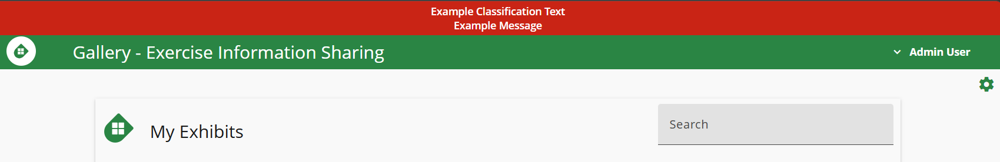

# Gallery Helm Chart

[Gallery](https://cmu-sei.github.io/crucible/gallery/) is the [Crucible](https://cmu-sei.github.io/crucible/) application that enables participants to review cyber incident data by source type. Information is grouped by critical infrastructure sector or organizational categories, with support for multiple source types including intelligence, reporting, orders, news, social media, telephone, and email.

This Helm chart deploys Gallery with both [API](https://github.com/cmu-sei/Gallery.Api) and [UI](https://github.com/cmu-sei/Gallery.Ui) components.

## Prerequisites

- Kubernetes 1.19+
- Helm 3.0+
- PostgreSQL database with `uuid-ossp` extension installed
- Identity provider (e.g., [Keycloak](https://www.keycloak.org/)) for OAuth2/OIDC authentication

## Installation

```bash
helm repo add sei https://helm.cmusei.dev/charts
helm install gallery sei/gallery -f values.yaml
```

## Gallery API Configuration

The following are configured via the `gallery-api.env` settings. These Gallery API settings reflect the application's [appsettings.json](https://github.com/cmu-sei/Gallery.Api/blob/development/Gallery.Api/appsettings.json) which may contain more options than are described here.

### Logging

| Setting | Description | Example |
|-----------|-------------|---------|
| `Logging__IncludeScopes` | Include scopes in logging | `false` |
| `Logging__Debug__LogLevel__Default` | Debug log level default | `Warning` |
| `Logging__Debug__LogLevel__Microsoft` | Debug log level Microsoft | `Warning` |
| `Logging__Debug__LogLevel__System` | Debug log level System | `Warning` |
| `Logging__Console__LogLevel__Default` | Console log level default | `Warning` |
| `Logging__Console__LogLevel__Microsoft` | Console log level Microsoft | `Warning` |
| `Logging__Console__LogLevel__System` | Console log level System | `Warning` |

### Database Settings

| Setting | Description | Example |
|---------|-------------|---------|
| `ConnectionStrings__PostgreSQL` | PostgreSQL connection string | `Server=postgres;Port=5432;Database=gallery;Username=gallery;Password=PASSWORD;` |
| `Database__AutoMigrate` | Automatically apply database migrations | `true` |
| `Database__DevModeRecreate` | Recreate database on startup (dev only) | `false` |
| `Database__Provider` | Database provider | `PostgreSQL` |
| `Database__SeedFile` | Seed data file | `seed-data.json` |

**Important:** The PostgreSQL database must include the `uuid-ossp` extension:

```sql
CREATE EXTENSION IF NOT EXISTS "uuid-ossp";
```

### Authentication (OIDC)

| Setting | Description | Example |
|---------|-------------|---------|
| `Authorization__Authority` | Identity provider base URL | `https://identity.example.com` |
| `Authorization__AuthorizationUrl` | Authorization endpoint | `https://identity.example.com/connect/authorize` |
| `Authorization__TokenUrl` | Token endpoint | `https://identity.example.com/connect/token` |
| `Authorization__AuthorizationScope` | OAuth scope requested by the API | `gallery-api` |
| `Authorization__ClientId` | OAuth client ID used by Swagger and other interactive clients | `gallery-api` |
| `Authorization__ClientName` | Display name for the client (optional) | `Gallery` |
| `Authorization__ClientSecret` | OAuth2 client secret | `""` |
| `Authorization__RequireHttpsMetaData` | Require HTTPS for metadata | `false` |

### Claims Transformation

| Setting | Description | Example |
|-----------|-------------|---------|
| `ClaimsTransformation__EnableCaching` | Enable claims caching | `true` |
| `ClaimsTransformation__CacheExpirationSeconds` | Claims cache expiration in seconds | `60` |

### CORS Policy Settings

| Setting | Description | Example |
|-----------|-------------|---------|
| `CorsPolicy__Origins__0` | First allowed CORS origin | `https://gallery.example.com` |
| `CorsPolicy__Methods__0` | CORS allowed methods | `""` |
| `CorsPolicy__Headers__0` | CORS allowed headers | `""` |
| `CorsPolicy__AllowAnyOrigin` | Allow any CORS origin | `false` |
| `CorsPolicy__AllowAnyMethod` | Allow any CORS method | `true` |
| `CorsPolicy__AllowAnyHeader` | Allow any CORS header | `true` |
| `CorsPolicy__SupportsCredentials` | CORS supports credentials | `true` |

**Note:** Additional origins can be added using the pattern `CorsPolicy__Origins__1`, `CorsPolicy__Origins__2`, etc.

### xAPI Settings

Gallery API supports sending [xAPI](https://xapi.com/) (Experience API) statements to a Learning Record Store (LRS). Configure the options below to enable this integration.

| Setting | Description | Default |
|---------|-------------|---------|
| `XApiOptions__Enabled` | Enable xAPI statement recording | `false` |
| `XApiOptions__Endpoint` | LRS xAPI endpoint URL | `""` |
| `XApiOptions__Username` | LRS basic-auth username | `""` |
| `XApiOptions__Password` | LRS basic-auth password | `""` |
| `XApiOptions__IssuerUrl` | OIDC issuer URL used to build actor identifiers | `""` |
| `XApiOptions__ApiUrl` | Gallery API base URL (used in statement context) | `""` |
| `XApiOptions__UiUrl` | Gallery UI base URL (used in statement context) | `""` |
| `XApiOptions__EmailDomain` | Email domain appended to usernames for actor mbox | `""` |
| `XApiOptions__Platform` | Platform name reported in xAPI statements | `Gallery` |
| `XApiOptions__RetentionDays` | Number of days to retain processed xAPI records | `7` |
| `XApiOptions__ProcessingTimeoutMinutes` | Minutes before an in-progress statement times out | `10` |
| `XApiOptions__ProcessingDelaySeconds` | Seconds to wait between processing batches | `30` |

### Certificate Trust

Trust custom certificate authorities by referencing a Kubernetes ConfigMap that contains the CA bundle.

```yaml
gallery-api:
  certificateMap: "custom-ca-certs"
```

### Extra Environment Sources

Inject additional environment variables into the API container from existing Kubernetes Secrets or ConfigMaps using `extraEnvFrom`. This is useful for integrating with external secret managers such as AWS Secrets Manager (via the [External Secrets Operator](https://external-secrets.io/)) or HashiCorp Vault.

```yaml
gallery-api:
  extraEnvFrom:
    - secretRef:
        name: my-secret
    - configMapRef:
        name: my-configmap
```

Each entry follows the standard Kubernetes [`envFrom`](https://kubernetes.io/docs/tasks/configure-pod-container/configure-pod-configmap/#configure-all-key-value-pairs-in-a-configmap-as-container-environment-variables) spec and supports both `secretRef` and `configMapRef`.

### Helm Deployment Configuration

The following are configurations for the Gallery API Helm Chart and application configurations that are configured outside of the `gallery-api.env` section.

#### Health Probes

The deployment configures Kubernetes liveness, readiness, and startup probes against the API's `/api/health/live` and `/api/health/ready` endpoints. Defaults are tuned to tolerate slow startups (e.g. EF Core migrations, cold JIT) while still surfacing failures.

```yaml
gallery-api:
  probes:
    livenessProbe:
      enabled: true
      initialDelaySeconds: 30
      periodSeconds: 10
      timeoutSeconds: 15
      failureThreshold: 5
      successThreshold: 1
    readinessProbe:
      enabled: true
      initialDelaySeconds: 5
      periodSeconds: 10
      timeoutSeconds: 15
      failureThreshold: 5
      successThreshold: 1
    startupProbe:
      enabled: true
      initialDelaySeconds: 0
      periodSeconds: 10
      timeoutSeconds: 15
      failureThreshold: 15
      successThreshold: 1
```

Set `enabled: false` on a probe to disable it.

#### Ingress

Configure the ingress to allow connections to the application (typically uses an ingress controller like [ingress-nginx](https://github.com/kubernetes/ingress-nginx)).

```yaml
gallery-api:
  ingress:
    enabled: true
    className: "nginx"
    annotations:
      nginx.ingress.kubernetes.io/proxy-read-timeout: "86400"
      nginx.ingress.kubernetes.io/proxy-send-timeout: "86400"
      nginx.ingress.kubernetes.io/use-regex: "true"
    hosts:
      - host: gallery.example.com
        paths:
          - path: /(api|swagger|hubs)
            pathType: ImplementationSpecific
```

### OpenTelemetry

Gallery.Api is wired with [Crucible.Common.ServiceDefaults](https://github.com/cmu-sei/crucible-common-dotnet/tree/main/src/Crucible.Common.ServiceDefaults), which auto-enables [OpenTelemetry](https://opentelemetry.io/) logs/traces/metrics. Configure the OTLP exporter endpoint and service name for Gallery to send OTLP to an OpenTelemetry Collector (e.g., [Otel Collector](https://opentelemetry.io/docs/collector/) or [Grafana Alloy](https://grafana.com/docs/alloy/latest/)):

```yaml
gallery-api:
  env:
    # This can be a kubernetes service address if the collector is running in the cluster
    OTEL_EXPORTER_OTLP_ENDPOINT: http://otel-collector:4317

    # Optional: force HTTP instead of the default gRPC protocol
    # OTEL_EXPORTER_OTLP_PROTOCOL: http/protobuf
    # Optional: override the service name reported to collectors
    # OTEL_SERVICE_NAME: gallery-api

    # These settings toggle ServiceDefaults configurations for Otel
    # The values listed here are the defaults
    # OpenTelemetry__AddAlwaysOnTracingSampler: false
    # OpenTelemetry__AddConsoleExporter: false
    # OpenTelemetry__AddPrometheusExporter: false
    # OpenTelemetry__IncludeDefaultActivitySources: true
    # OpenTelemetry__IncludeDefaultMeters: true
```

| Setting | Description | Default |
|---------|-------------|---------|
| `OpenTelemetry__AddAlwaysOnTracingSampler` | Always sample every trace (useful for development; not recommended in high-traffic production) | `false` |
| `OpenTelemetry__AddConsoleExporter` | Export traces and metrics to stdout in addition to the OTLP endpoint | `false` |
| `OpenTelemetry__AddPrometheusExporter` | Expose a `/metrics` scrape endpoint for Prometheus | `false` |
| `OpenTelemetry__IncludeDefaultActivitySources` | Register the default ASP.NET Core, HttpClient, and EF Core activity sources | `true` |
| `OpenTelemetry__IncludeDefaultMeters` | Register the default ASP.NET Core, HttpClient, and runtime meters | `true` |

#### Default metrics from ServiceDefaults
- Instrumentations: ASP.NET Core, HttpClient, Entity Framework Core, .NET runtime, and process resource metrics.
- Built-in meters: `Microsoft.AspNetCore.Hosting`, `Microsoft.AspNetCore.Server.Kestrel`, `System.Net.Http`, `System.Net.NameResolution`, `Microsoft.EntityFrameworkCore`, plus runtime/process meters.
- Resource attribute `service_name` defaults to `gallery-api` (or your `OTEL_SERVICE_NAME` override).

## Gallery UI Configuration

Use `settingsYaml` to configure the Angular UI application. The table below highlights common settings.

| Setting | Description | Example |
|---------|-------------|---------|
| `ApiUrl` | Base URL for the Gallery API | `https://gallery.example.com` |
| `AppTitle` | Browser/application title | `Gallery` |
| `AppTopBarHexColor` | Hex color for the top bar background | `#2d69b4` |
| `AppTopBarHexTextColor` | Hex color for the top bar text | `#FFFFFF` |
| `AppTopBarText` | Banner text displayed in the top bar | `Gallery - Exercise Information Sharing` |
| `AppTopBarImage` | Path to the banner image | `/assets/img/monitor-dashboard-white.png` |
| `OIDCSettings.authority` | OIDC authority URL | `https://identity.example.com/` |
| `OIDCSettings.client_id` | OAuth client ID for the Gallery UI | `gallery-ui` |
| `OIDCSettings.redirect_uri` | Callback URL after login | `https://gallery.example.com/auth-callback` |
| `OIDCSettings.post_logout_redirect_uri` | URL users return to after logout | `https://gallery.example.com` |
| `OIDCSettings.response_type` | OAuth response type | `code` |
| `OIDCSettings.scope` | Space-delimited scopes requested during login | `openid profile gallery` |
| `OIDCSettings.automaticSilentRenew` | Enables background token renewal | `true` |
| `OIDCSettings.silent_redirect_uri` | URI for silent token renewal callbacks | `https://gallery.example.com/auth-callback-silent.html` |
| `UseLocalAuthStorage` | Persist auth state in browser local storage | `true` |

### Shared Settings ConfigMap

`sharedSettingsConfigMap` mounts a pre-existing Kubernetes ConfigMap as `settings.shared.json` into the Angular app's `assets/config/` directory alongside `settings.env.json`. This is intended for UI configuration values that are consistent across several Crucible applications, so the values only need to be defined in one place. Any value in the shared file can be overridden per-application using `settingsYaml`.

```yaml
gallery-ui:
  sharedSettingsConfigMap: "crucible-shared-ui-settings"
```

The referenced ConfigMap must contain a key named `settings.shared.json`:

```yaml
apiVersion: v1
kind: ConfigMap
metadata:
  name: crucible-shared-ui-settings
data:
  settings.shared.json: |
    {
      "HeaderBarSettings": {
        "banner_background_color": "#d40000ff",
        "classification_text": "EXAMPLE // CLASSIFICATION",
        "enabled": true
      }
    }
```

When `sharedSettingsConfigMap` is not set (the default), no shared settings file is mounted and the behavior is unchanged.

### Classification Banner

Gallery UI supports an optional classification banner via `HeaderBarSettings`. The banner is enabled by default with empty message values, resulting in no header bar being shown to the user. Configure `classification_text` and `message_text` to display content.

| Setting | Description | Default |
|---------|-------------|---------|
| `HeaderBarSettings.enabled` | Show or hide the classification banner | `true` |
| `HeaderBarSettings.banner_background_color` | Background color of the banner (hex with alpha) | `#d40000ff` |
| `HeaderBarSettings.classification_text` | Classification label displayed in the banner | `""` |
| `HeaderBarSettings.classification_text_color` | Color of the classification label text | `#ffffff` |
| `HeaderBarSettings.classification_text_fontsize` | Font size (px) of the classification label | `"14"` |
| `HeaderBarSettings.message_text` | Secondary message text displayed in the banner | `""` |
| `HeaderBarSettings.message_text_color` | Color of the secondary message text | `#ffffff` |
| `HeaderBarSettings.message_text_fontsize` | Font size (px) of the secondary message text | `"14"` |

Example:

```yaml
gallery-ui:
  settingsYaml:
    HeaderBarSettings:
      enabled: true
      banner_background_color: "#d40000ff"
      classification_text: "Example Classification Test"
      classification_text_color: "#ffffff"
      classification_text_fontsize: "14"
      message_text: "Example Message"
      message_text_color: "#ffffff"
      message_text_fontsize: "14"
```



## References

- [Gallery Documentation](https://cmu-sei.github.io/crucible/gallery/)
- [Gallery API Repository](https://github.com/cmu-sei/Gallery.Api)
- [Gallery UI Repository](https://github.com/cmu-sei/Gallery.Ui)
