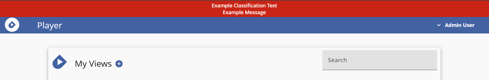

# Player Helm Chart

[Player](https://cmu-sei.github.io/crucible/player/) is the [Crucible](https://cmu-sei.github.io/crucible/) window into virtual environments. Player enables assignment of team membership and customization of responsive, browser-based user interfaces using various integrated applications. Administrators can shape how scenario information, assessments, and virtual environments are presented.

This Helm chart deploys the full Player stack of integrated components:
- [Player API](https://github.com/cmu-sei/Player.Api) - Backend API for the main Player application
- [Player UI](https://github.com/cmu-sei/Player.Ui) - Frontend web interface for the main Player application
- [VM API](https://github.com/cmu-sei/VM.Api) - Backend API for the VM application that integrates with Player to display and manage virtual machines
- [VM UI](https://github.com/cmu-sei/VM.Ui) - Frontend web interface for the VM application that integrates with Player to display and manage virtual machines
- [Console UI](https://github.com/cmu-sei/console.Ui) - VMware Virtual Machine console viewer used by the VM application (above)

## Prerequisites

- Kubernetes 1.19+
- Helm 3.0+
- PostgreSQL
- Identity provider (e.g., [Keycloak](https://www.keycloak.org/)) for OAuth2/OIDC authentication
- VMware vSphere/vCenter or Proxmox for VM management
- NFS storage for ISO files (optional)

## Installation

```bash
helm repo add sei https://helm.cmusei.dev/charts
helm install player sei/player -f values.yaml
```

## Player API Configuration

The following are configured via the `player-api.env` settings. These Player API settings reflect the application's [appsettings.json](https://github.com/cmu-sei/Player.Api/blob/main/Player.Api/appsettings.json) which may contain more settings than are described here.

### General

| Setting | Description | Example |
|-----------|-------------|---------|
| `PathBase` | Virtual directory path base | `""` |
| `SKIP_VOL_PERMISSIONS` | Skip volume permissions setup | `false` |

### Database

| Setting | Description | Example |
|-----------|-------------|---------|
| `ConnectionStrings__PostgreSQL` | PostgreSQL connection string | `Server=postgres;Port=5432;Database=player_api;Username=player;Password=PASSWORD;` |
| `Database__AutoMigrate` | Automatically apply database migrations | `true` |
| `Database__DevModeRecreate` | Recreate database on startup (dev only) | `false` |
| `Database__Provider` | Database provider | `PostgreSQL` |

**Important:**
Database requires the `uuid-ossp` extension:

```sql
CREATE EXTENSION IF NOT EXISTS "uuid-ossp";
```

### Authentication (OIDC)

| Setting | Description | Example |
|-----------|-------------|---------|
| `Authorization__Authority` | Identity provider URL | `https://identity.example.com` |
| `Authorization__AuthorizationUrl` | Authorization endpoint | `https://identity.example.com/connect/authorize` |
| `Authorization__TokenUrl` | Token endpoint | `https://identity.example.com/connect/token` |
| `Authorization__AuthorizationScope` | OAuth scopes | `player-api` |
| `Authorization__ClientId` | OAuth client ID | `vm-api` |
| `Authorization__ClientSecret` | OAuth2 client secret | `""` |
| `Authorization__RequireHttpsMetaData` | Require HTTPS for metadata | `false` |

### Claims Transformation

| Setting | Description | Example |
|-----------|-------------|---------|
| `ClaimsTransformation__EnableCaching` | Enable claims caching | `true` |
| `ClaimsTransformation__CacheExpirationSeconds` | Claims cache expiration in seconds | `60` |

### Logging

| Setting | Description | Example |
|-----------|-------------|---------|
| `Logging__IncludeScopes` | Include scopes in logging | `false` |
| `Logging__Debug__LogLevel__Default` | Debug log level default | `Information` |
| `Logging__Debug__LogLevel__Microsoft` | Debug log level Microsoft | `Error` |
| `Logging__Debug__LogLevel__System` | Debug log level System | `Error` |
| `Logging__Console__LogLevel__Default` | Console log level default | `Information` |
| `Logging__Console__LogLevel__Microsoft` | Console log level Microsoft | `Error` |
| `Logging__Console__LogLevel__System` | Console log level System | `Error` |

### Certificate Trust

Trust custom certificate authorities by referencing a Kubernetes ConfigMap that contains the CA bundle.

```yaml
player-api:
  certificateMap: "custom-ca-certs"
```

### Extra Environment Sources

Inject additional environment variables into the API container from existing Kubernetes Secrets or ConfigMaps using `extraEnvFrom`. This is useful for integrating with external secret managers such as AWS Secrets Manager (via the [External Secrets Operator](https://external-secrets.io/)) or HashiCorp Vault.

```yaml
player-api:
  extraEnvFrom:
    - secretRef:
        name: my-secret
    - configMapRef:
        name: my-configmap
```

Each entry follows the standard Kubernetes [`envFrom`](https://kubernetes.io/docs/tasks/configure-pod-container/configure-pod-configmap/#configure-all-key-value-pairs-in-a-configmap-as-container-environment-variables) spec and supports both `secretRef` and `configMapRef`.

### CORS

Add CORS origins to allow bidirectional communication between Player and the integrated apps.

| Setting | Description | Example |
|-----------|-------------|---------|
| `CorsPolicy__Origins__0` | Player UI URL | `https://player.example.com` |
| `CorsPolicy__Origins__1` | VM UI URL | `https://vm.example.com` |
| `CorsPolicy__Origins__2` | Other integrated apps (e.g., OSTicket) | `https://osticket.example.com` |
| `CorsPolicy__Methods__0` | CORS allowed methods | `""` |
| `CorsPolicy__Headers__0` | CORS allowed headers | `""` |
| `CorsPolicy__AllowAnyOrigin` | Allow any CORS origin | `false` |
| `CorsPolicy__AllowAnyMethod` | Allow any CORS method | `true` |
| `CorsPolicy__AllowAnyHeader` | Allow any CORS header | `true` |
| `CorsPolicy__SupportsCredentials` | CORS supports credentials | `true` |

Add more origins with `__3`, `__4`, etc.

### Notifications

| Setting | Description | Example |
|-----------|-------------|---------|
| `Notifications__UserIconUrl` | User notification icon URL | `"/assets/img/SP_Icon_User.png"` |
| `Notifications__SystemIconUrl` | System notification icon URL | `"/assets/img/SP_Icon_Alert.png"` |
| `Notifications__HelpDeskApplicationName` | Help desk application name | `"Help Desk"` |

### File Upload

| Setting | Description | Example |
|-----------|-------------|---------|
| `FileUpload__basePath` | File upload base path | `"/fileupload"` |
| `FileUpload__maxSize` | File upload max size | `"64000000"` |
| `FileUpload__allowedExtensions__0` | Allowed file extension | `.pdf` |
| `FileUpload__allowedExtensions__1` | Allowed file extension | `.png` |
| `FileUpload__allowedExtensions__2` | Allowed file extension | `.jpg` |
| `FileUpload__allowedExtensions__3` | Allowed file extension | `.jpeg` |
| `FileUpload__allowedExtensions__4` | Allowed file extension | `.doc` |
| `FileUpload__allowedExtensions__5` | Allowed file extension | `.docx` |
| `FileUpload__allowedExtensions__6` | Allowed file extension | `.gif` |
| `FileUpload__allowedExtensions__7` | Allowed file extension | `.txt` |

### Seed Data
Optionally bootstrap roles, permissions, and users:

```yaml
player-api:
  env:
    # Custom Permission for your application
    SeedData__Permissions__0__Name: "MyPermission"
    SeedData__Permissions__0__Description: "Does something in my app"

    # Custom TeamPermission for your application
    SeedData__TeamPermissions__0__Name: "MyTeamPermission"
    SeedData__TeamPermissions__0__Description: "Does something for a team in my app"

    # Custom Role
    SeedData__Roles__0__Name: "My Environment Administrator"
    SeedData__Roles__0__AllPermissions: true

    # Custom Team Role
    SeedData__TeamRoles__0__Name: "Team Lead"
    SeedData__TeamRoles__0__Permissions__0: "ManageTeam"

    # Explicitly give a User a Role before they log in.
    SeedData__Users__0__Id: "user-guid-from-identity"
    SeedData__Users__0__Name: "Admin User"
    SeedData__Users__0__Role: "Administrator"
```

### Storage
Configure Player to use a new Kubernetes Persistent Volume Claim to store uploaded files (see the Kubernetes documentation for creating [Persistent Volumes and Persistent Volume Claims](https://kubernetes.io/docs/tasks/configure-pod-container/configure-persistent-volume-storage/)).

```yaml
player-api:
  storage:
    # Option 1: Use existing PVC
    existing: "player-storage"

    # Option 2: Create new PVC
    size: "10Gi"
    mode: ReadWriteOnce
    class: "default"
```

### Ingress
Configure the ingress to allow connections to the application (typically uses an ingress controller like [ingress-nginx](https://github.com/kubernetes/ingress-nginx)).

```yaml
player-api:
  ingress:
    enabled: true
    className: "nginx"
    annotations:
      nginx.ingress.kubernetes.io/proxy-read-timeout: "86400"
      nginx.ingress.kubernetes.io/proxy-send-timeout: "86400"
      nginx.ingress.kubernetes.io/use-regex: "true"
    hosts:
      - host: player.example.com
        paths:
          - path: /(hubs|swagger|api)
            pathType: ImplementationSpecific
```

### OpenTelemetry

Player.Api is wired with [Crucible.Common.ServiceDefaults](https://github.com/cmu-sei/crucible-common-dotnet/tree/main/src/Crucible.Common.ServiceDefaults), which auto-enables [OpenTelemetry](https://opentelemetry.io/) logs/traces/metrics. Configure the OTLP exporter endpoint and service name for Player to send OTLP to an OpenTelemetry Collector (e.g., [Otel Collector](https://opentelemetry.io/docs/collector/) or [Grafana Alloy](https://grafana.com/docs/alloy/latest/)):

```yaml
player-api:
  env:
    # This can be a kubernetes service address if the collector is running in the cluster
    OTEL_EXPORTER_OTLP_ENDPOINT: http://otel-collector:4317

    # Optional: force HTTP instead of the default gRPC protocol
    # OTEL_EXPORTER_OTLP_PROTOCOL: http/protobuf
    # Optional: override the service name reported to collectors
    # OTEL_SERVICE_NAME: player-api
```

#### Custom metrics from Player
- Meter: `player_view_users`
- Gauge: `player_view_active_users` (current active users)
- Exposed both via OTLP and the built-in Prometheus scraper endpoint.

#### Default metrics from ServiceDefaults
- Instrumentations: ASP.NET Core, HttpClient, Entity Framework Core, .NET runtime, and process resource metrics.
- Built-in meters: `Microsoft.AspNetCore.Hosting`, `Microsoft.AspNetCore.Server.Kestrel`, `System.Net.Http`, `System.Net.NameResolution`, `Microsoft.EntityFrameworkCore`, plus runtime/process meters.
- Resource attribute `service_name` defaults to `player-api` (or your `OTEL_SERVICE_NAME` override).

#### Example Grafana/Prometheus queries
Use the Prometheus datasource in Grafana:

```promql
# Custom Player gauge (should have recent samples when active users exist)
max_over_time(player_view_active_users{service_name="player-api"}[5m])

# ASP.NET Core request rate (default instrumentation)
rate(http_server_request_duration_seconds_count{service_name="player-api"}[5m])

# Process CPU (default process instrumentation)
avg(rate(process_cpu_seconds_total{service_name="player-api"}[5m])) by (service_name)

# EF Core command latency (default EF instrumentation)
histogram_quantile(0.95, sum by (le)(
  rate(entityframeworkcore_command_duration_seconds_bucket{service_name="player-api"}[5m])
))
```

## Player UI

| Setting | Description | Example |
|---------|-------------|---------|
| `APP_BASEHREF` | To host Player from a subpath | `/player` |

Use `settingsYaml` to configure settings for the Angular UI application.

| Setting                      | Description                                                 | Example Value                                      |
|------------------------------|-------------------------------------------------------------|----------------------------------------------------|
| `ApiUrl`                     | Base URL for the Player API                                 | `https://player.example.com`                       |
| `OIDCSettings.authority`     | URL of the identity provider (OIDC authority)               | `https://identity.example.com`                     |
| `OIDCSettings.client_id`     | OAuth client ID used by the Player UI                       | `player-ui`                                    |
| `OIDCSettings.redirect_uri`  | URI where the identity provider redirects after login       | `https://player.example.com/auth-callback/`        |
| `OIDCSettings.post_logout_redirect_uri` | URI users are redirected to after logout         | `https://player.example.com`                       |
| `OIDCSettings.response_type` | OAuth response type defining the authentication flow        | `code`                                             |
| `OIDCSettings.scope`         | Space-delimited list of OAuth scopes requested              | `openid profile player-api`                        |
| `OIDCSettings.automaticSilentRenew` | Enables automatic token renewal                      | `true`                                             |
| `OIDCSettings.silent_redirect_uri`  | URI for silent token renewal callbacks               | `https://player.example.com/auth-callback-silent/` |
| `UseLocalAuthStorage`        | Whether authentication state is stored locally in browser   | `true`                                             |
| `NotificationsSettings.url`  | URL for receiving notifications                             | `https://player.example.com/hubs`                  |
| `NotificationsSettings.number_to_display` | Number of items in the notification area       | `4`                                                |


## VM API Configuration

The following are configured via the `vm-api.env` settings. These VM API settings reflect the application's [appsettings.json](https://github.com/cmu-sei/Vm.Api/blob/main/src/Player.Vm.Api/appsettings.json) which may contain more settings than are described here.

### General

| Setting | Description | Example |
|-----------|-------------|---------|
| `PathBase` | Virtual directory path base | `""` |

### Database

| Setting | Description | Example |
|-----------|-------------|---------|
| `ConnectionStrings__PostgreSQL` | PostgreSQL connection string for VM API | `Server=postgres;Port=5432;Database=vm_api;Username=vm_user;Password=PASSWORD;` |
| `Database__AutoMigrate` | Automatically apply database migrations | `true` |
| `Database__DevModeRecreate` | Recreate database on startup (dev only) | `false` |
| `Database__Provider` | Database provider | `PostgreSQL` |

### Authentication (OIDC)

| Setting | Description | Example |
|-----------|-------------|---------|
| `Authorization__Authority` | Identity provider URL | `https://identity.example.com` |
| `Authorization__AuthorizationUrl` | Authorization endpoint | `https://identity.example.com/connect/authorize` |
| `Authorization__TokenUrl` | Token endpoint | `https://identity.example.com/connect/token` |
| `Authorization__AuthorizationScope` | OAuth scopes | `vm-api player-api` |
| `Authorization__ClientId` | OAuth client ID | `vm-api` |
| `Authorization__ClientSecret` | OAuth2 client secret | `""` |
| `Authorization__RequireHttpsMetaData` | Require HTTPS for metadata | `false` |

### Logging

| Setting | Description | Example |
|-----------|-------------|---------|
| `Logging__IncludeScopes` | Include scopes in logging | `false` |
| `Logging__Debug__LogLevel__Default` | Debug log level default | `Information` |
| `Logging__Debug__LogLevel__Microsoft` | Debug log level Microsoft | `Error` |
| `Logging__Debug__LogLevel__System` | Debug log level System | `Error` |
| `Logging__Console__LogLevel__Default` | Console log level default | `Information` |
| `Logging__Console__LogLevel__Microsoft` | Console log level Microsoft | `Error` |
| `Logging__Console__LogLevel__System` | Console log level System | `Error` |

### Certificate Trust

Trust custom certificate authorities by referencing a Kubernetes ConfigMap that contains the CA bundle.

```yaml
vm-api:
  certificateMap: "custom-ca-certs"
```

### Extra Environment Sources

Inject additional environment variables into the VM API container from existing Kubernetes Secrets or ConfigMaps using `extraEnvFrom`. This is useful for integrating with external secret managers such as AWS Secrets Manager (via the [External Secrets Operator](https://external-secrets.io/)) or HashiCorp Vault.

```yaml
vm-api:
  extraEnvFrom:
    - secretRef:
        name: my-secret
    - configMapRef:
        name: my-configmap
```

Each entry follows the standard Kubernetes [`envFrom`](https://kubernetes.io/docs/tasks/configure-pod-container/configure-pod-configmap/#configure-all-key-value-pairs-in-a-configmap-as-container-environment-variables) spec and supports both `secretRef` and `configMapRef`.

### Player API Integration

VM API needs to communicate to the Crucible [VM API](https://github.com/cmu-sei/vm.Api) application via a Resource Owner OAuth Flow for API-to-API communication using a service account. Use the following settings to configure the Resource Owner flow.

| Setting | Description | Example |
|-----------|-------------|---------|
| `ClientSettings__urls__playerApi` | Player API URL | `https://player.example.com/` |
| `IdentityClient__TokenUrl` | Token endpoint | `https://identity.example.com/connect/token` |
| `IdentityClient__ClientId` | Service account client ID | `vm-api` |
| `IdentityClient__Username` | Service account username | `vm-service` |
| `IdentityClient__Password` | Service account password | `password` |
| `IdentityClient__Scope` | Service account scopes | `player-api` |
| `IdentityClient__MaxRetryDelaySeconds` | Identity client max retry delay | `120` |
| `IdentityClient__TokenRefreshSeconds` | Identity client token refresh | `600` |


### vSphere Configuration

VM API supports connection to multiple vSphere instances. Use the following settings to configure each vSphere host. Replace the `*` with the host index (starting at 0).

| Setting | Description | Example |
|-----------|-------------|---------|
| `Vsphere__Hosts__*__Enabled` | Boolean that enables this vSphere host | `true` |
| `Vsphere__Hosts__*__Address` | vCenter hostname or IP address | `vcenter.example.com` |
| `Vsphere__Hosts__*__Username` | vCenter username | `player-account@vsphere.local` |
| `Vsphere__Hosts__*__Password` | vCenter password | `password` |
| `Vsphere__Hosts__*__DsName` | Datastore name for file storage | `nfs-player` |
| `Vsphere__Hosts__*__BaseFolder` | Folder within datastore | `player` |
| `Vsphere__Timeout` | vSphere timeout | `30` |
| `Vsphere__ConnectionRetryIntervalSeconds` | vSphere connection retry interval | `60` |
| `Vsphere__ConnectionRefreshIntervalMinutes` | vSphere connection refresh interval | `20` |
| `Vsphere__LoadCacheAfterMinutes` | vSphere load cache delay | `5` |
| `Vsphere__ConnectionTimeoutSeconds` | vSphere connection timeout | `90` |
| `Vsphere__LogConsoleAccess` | Log console access | `false` |
| `Vsphere__CheckTaskProgressIntervalMilliseconds` | Task progress check interval | `5000` |
| `Vsphere__ReCheckTaskProgressIntervalMilliseconds` | Task progress recheck interval | `1000` |
| `Vsphere__HealthAllowanceSeconds` | Health allowance seconds | `180` |

**Important:**
- Requires a privileged vCenter user for file operations
- Datastore should be NFS for ease of access
- Format: `<DATASTORE>/player/` (if BaseFolder is provided)

#### Console Proxy (Optional)

For proxying VM console connections through nginx ingress:

```yaml
vm-api:
  env:
    RewriteHost__RewriteHost: true
    RewriteHost__RewriteHostUrl: "connect.example.com"
    RewriteHost__RewriteHostQueryParam: "vmhost"

  consoleIngress:
    deployConsoleProxy: true
    hosts:
      - host: connect.example.com
        paths: []
    tls:
      - secretName: console-tls
        hosts:
          - connect.example.com
```

**How it works:**
- Console UI connects to: `wss://connect.example.com/ticket/TICKET?vmhost=10.4.52.68`
- Nginx proxies to: `https://10.4.52.68/ticket/TICKET`

**When to use:**
- vCenter hosts are on private network
- Additional security layer for consoles
- Centralized TLS termination

#### ISO Storage (Optional)

Mount NFS volume for ISO uploads:

```yaml
vm-api:
  iso:
    enabled: true
    server: "nfs-server.example.com"
    path: "/exports/isos"
    size: "100Gi"
```

#### ISO Upload

| Setting | Description | Example |
|-----------|-------------|---------|
| `IsoUpload__BasePath` | ISO upload base path | `"/app/isos/player"` |
| `IsoUpload_MaxFileSize` | ISO upload max file size | `6000000000` |

#### CORS

| Setting | Description | Example |
|-----------|-------------|---------|
| `CorsPolicy__Origins__0` | VM UI URL | `https://vm.example.com` |
| `CorsPolicy__Origins__1` | Console UI URL | `https://console.example.com` |
| `CorsPolicy__Methods__0` | CORS allowed methods | `""` |
| `CorsPolicy__Headers__0` | CORS allowed headers | `""` |
| `CorsPolicy__AllowAnyOrigin` | Allow any CORS origin | `false` |
| `CorsPolicy__AllowAnyMethod` | Allow any CORS method | `true` |
| `CorsPolicy__AllowAnyHeader` | Allow any CORS header | `true` |
| `CorsPolicy__SupportsCredentials` | CORS supports credentials | `true` |

### Ingress

Configure the ingress to allow connections to the application (typically uses an ingress controller like [ingress-nginx](https://github.com/kubernetes/ingress-nginx)).

```yaml
vm-api:
  ingress:
    enabled: true
    className: "nginx"
    annotations:
      nginx.ingress.kubernetes.io/proxy-read-timeout: "86400"
      nginx.ingress.kubernetes.io/proxy-send-timeout: "86400"
      nginx.ingress.kubernetes.io/use-regex: "true"
      nginx.ingress.kubernetes.io/proxy-body-size: "100m"
    hosts:
      - host: vm.example.com
        paths:
          - path: /(notifications|hubs|api|swagger)
            pathType: ImplementationSpecific
```

## VM UI Configuration

| Setting | Description | Example |
|---------|-------------|---------|
| `APP_BASEHREF` | To host VM UI from a subpath | `/vm-ui` |

Use `settingsYaml` to configure settings for the Angular UI application.

| Setting                         | Description                                        | Example Value                                     |
|---------------------------------|----------------------------------------------------|---------------------------------------------------|
| `ApiUrl`           | Base URL for the VM API                                         | `https://vm.example.com/api`                      |
| `ApiPlayerUrl`     | Base URL for the Player API interface                           | `https://player.example.com/api`                  |
| `UserFollowUrl`    | URL scheme for the User Follow feature of Console UI            | `https://console.example.com/user/{userId}/view/{viewId}/console` |
| `OIDCSettings.authority` | URL of the identity provider (OIDC authority)             | `https://identity.example.com`                    |
| `OIDCSettings.client_id` | OAuth client ID used by the VM UI                         | `vm-ui`                                       |
| `OIDCSettings.redirect_uri`  | URI where the identity provider redirects after login | `https://vm.example.com/auth-callback/`           |
| `OIDCSettings.post_logout_redirect_uri` | URI users are redirected to after logout   | `https://vm.example.com`                          |
| `OIDCSettings.response_type` | OAuth response type defining the authentication flow  | `code`                                            |
| `OIDCSettings.scope`         | Space-delimited list of OAuth scopes requested        | `openid profile player-api vm-api`                |
| `OIDCSettings.automaticSilentRenew` | Enables automatic token renewal                | `true`                                            |
| `OIDCSettings.silent_redirect_uri`  | URI for silent token renewal callbacks         | `https://vm.example.com/auth-callback-silent/`    |
| `UseLocalAuthStorage` | Whether authentication state is stored locally in browser    | `true`                                            |


### Console UI Configuration

| Setting | Description | Example |
|---------|-------------|---------|
| `APP_BASEHREF` | To host Console UI from a subpath | `/console-ui` |

Use `settingsYaml` to configure settings for the Angular UI application.

| Setting                         | Description                                        | Example Value                                       |
|---------------------------------|----------------------------------------------------|-----------------------------------------------------|
| `ConsoleApiUrl`    | Base URL for the VM API                                         | `https://vm.example.com/api/`                       |
| `OIDCSettings.authority` | URL of the identity provider (OIDC authority)             | `https://identity.example.com`                      |
| `OIDCSettings.client_id` | OAuth client ID used by the VM UI                         | `vm-console-ui`                                 |
| `OIDCSettings.redirect_uri`  | URI where the identity provider redirects after login | `https://console.example.com/auth-callback/`        |
| `OIDCSettings.post_logout_redirect_uri` | URI users are redirected to after logout   | `https://console.example.com`                       |
| `OIDCSettings.response_type` | OAuth response type defining the authentication flow  | `code`                                              |
| `OIDCSettings.scope`         | Space-delimited list of OAuth scopes requested        | `openid profile player-api vm-api vm-console-api`   |
| `OIDCSettings.automaticSilentRenew` | Enables automatic token renewal                | `true`                                              |
| `OIDCSettings.silent_redirect_uri`  | URI for silent token renewal callbacks         | `https://console.example.com/auth-callback-silent/` |
| `UseLocalAuthStorage` | Whether authentication state is stored locally in browser    | `true`                                              |
| `VmResolutionOptions` | List of width/height configurations for allowable display resolutions | `- width: 1920`<br>`  height: 1200`<br>`- width: 16280`<br>`  height: 1024` |

## Shared Settings ConfigMap

`sharedSettingsConfigMap` mounts a pre-existing Kubernetes ConfigMap as `settings.shared.json` into the Angular app's `assets/config/` directory alongside `settings.env.json`. This is intended for UI configuration values that are consistent across several Crucible applications, so the values only need to be defined in one place. Any value in the shared file can be overridden per-application using `settingsYaml`. Each Player UI application (player-ui, vm-ui, console-ui) can be configured independently.

```yaml
player-ui:
  sharedSettingsConfigMap: "crucible-shared-ui-settings"
vm-ui:
  sharedSettingsConfigMap: "crucible-shared-ui-settings"
console-ui:
  sharedSettingsConfigMap: "crucible-shared-ui-settings"
```

The referenced ConfigMap must contain a key named `settings.shared.json`:

```yaml
apiVersion: v1
kind: ConfigMap
metadata:
  name: crucible-shared-ui-settings
data:
  settings.shared.json: |
    {
      "HeaderBarSettings": {
        "banner_background_color": "#d40000ff",
        "classification_text": "EXAMPLE // CLASSIFICATION",
        "enabled": true
      }
    }
```

When `sharedSettingsConfigMap` is not set (the default), no shared settings file is mounted and the behavior is unchanged.

## Classification Banner

All Player UI applications (player-ui, vm-ui, console-ui) support an optional classification banner via `HeaderBarSettings`. The banner is enabled by default with empty message values, resulting in no header bar being shown to the user. Configure `classification_text` and `message_text` to display content.


| Setting | Description | Default |
|---------|-------------|---------|
| `HeaderBarSettings.enabled` | Show or hide the classification banner | `true` |
| `HeaderBarSettings.banner_background_color` | Background color of the banner (hex with alpha) | `#d40000ff` |
| `HeaderBarSettings.classification_text` | Classification label displayed in the banner | `""` |
| `HeaderBarSettings.classification_text_color` | Color of the classification label text | `#ffffff` |
| `HeaderBarSettings.classification_text_fontsize` | Font size (px) of the classification label | `"14"` |
| `HeaderBarSettings.message_text` | Secondary message text displayed in the banner | `""` |
| `HeaderBarSettings.message_text_color` | Color of the secondary message text | `#ffffff` |
| `HeaderBarSettings.message_text_fontsize` | Font size (px) of the secondary message text | `"14"` |

Configure each UI application's `HeaderBarSettings` individually.

Example:

```yaml
player-ui:
  settingsYaml:
    HeaderBarSettings:
      enabled: true
      banner_background_color: "#d40000ff"
      classification_text: "Example Classification Test"
      classification_text_color: "#ffffff"
      classification_text_fontsize: "14"
      message_text: "Example Message"
      message_text_color: "#ffffff"
      message_text_fontsize: "14"
```



## Troubleshooting

### Database Connection Issues
- Verify both `player_api` and `vm_api` databases exist
- Ensure `uuid-ossp` extension is installed in both databases
- Check connection string credentials and network access

### vSphere Connection Failures
- Verify vCenter is accessible from VM API pod
- Check vCenter credentials have appropriate permissions
- Ensure datastore exists and is accessible
- For self-signed certs, consider trust configuration

### Authentication Issues
- Verify all OAuth clients are registered in identity provider
- Check that scopes match between Player/VM and identity provider
- Ensure service account credentials are correct
- Verify CORS origins include all UI URLs

### Console Connection Problems
- If using proxy: verify `RewriteHost__RewriteHostUrl` matches ingress host
- Check that WebSocket connections aren't blocked
- Verify console ingress snippet annotations are allowed
- Try direct connection first (without proxy) to isolate issue

### SignalR/Notifications Not Working
- Verify `/hubs` path is included in ingress
- Check ingress timeout settings (must be long for WebSockets)
- Ensure CORS is properly configured
- Verify `NotificationsSettings.url` in Player UI matches Player API URL

### ISO Upload Failures
- Check `proxy-body-size` annotation is set depending on your ISO size needs
- Verify NFS mount is accessible if using `iso.enabled`
- Ensure vCenter datastore has sufficient space
- Check file permissions on datastore

## References

- [Player Documentation](https://cmu-sei.github.io/crucible/player/)
- [Player API Repository](https://github.com/cmu-sei/Player.Api)
- [Player Console UI Repository](https://github.com/cmu-sei/Console.Ui)
- [Player UI Repository](https://github.com/cmu-sei/Player.Ui)
- [Player VM API Repository](https://github.com/cmu-sei/Vm.Api)
- [Player VM UI Repository](https://github.com/cmu-sei/Vm.Ui)
