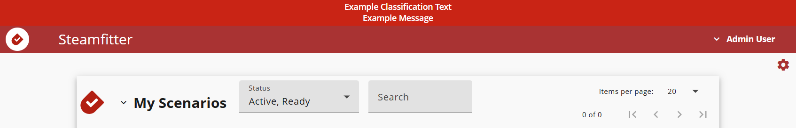

# Steamfitter Helm Chart

[Steamfitter](https://cmu-sei.github.io/crucible/steamfitter/) is the [Crucible](https://cmu-sei.github.io/crucible/) application that enables the organization and execution of scenario tasks on virtual machines. It automates workflows and executes commands using [StackStorm](https://stackstorm.com/) as its automation engine.

Steamfitter manages scenario-based automation by:
- Organizing tasks into scenarios and sessions
- Scheduling task execution on VMs
- Integrating with [StackStorm](https://stackstorm.com/) for workflow automation
- Coordinating with [Player](https://github.com/cmu-sei/Player.Api) for VM and team information

This Helm chart deploys Steamfitter with both [API](https://github.com/cmu-sei/steamfitter.api) and [UI](https://github.com/cmu-sei/steamfitter.ui) components.

## Prerequisites

- Kubernetes 1.19+
- Helm 3.0+
- PostgreSQL database with `uuid-ossp` extension installed
- Identity provider (e.g., [Keycloak](https://www.keycloak.org/)) for OAuth2/OIDC authentication
- [StackStorm](https://stackstorm.com/) instance for task execution
- Crucible [Player](https://github.com/cmu-sei/Player.Api) and [VM API](https://github.com/cmu-sei/vm.Api) instances

## Installation

```bash
helm repo add sei https://helm.cmusei.dev/charts
helm install steamfitter sei/steamfitter -f values.yaml
```

## Steamfitter API Configuration

The following are configured via the `steamfitter-api.env` settings. These Steamfitter API settings reflect the application's [appsettings.json](https://github.com/cmu-sei/Steamfitter.Api/blob/development/Steamfitter.Api/appsettings.json) which may contain more settings than are described here.

### Database Settings

| Setting | Description | Example |
|---------|-------------|---------|
| `PathBase` | Virtual directory path base | `""` |
| `Logging__IncludeScopes` | Include scopes in logging | `false` |
| `Logging__Debug__LogLevel__Default` | Debug log level default | `Information` |
| `Logging__Debug__LogLevel__Microsoft` | Debug log level Microsoft | `Error` |
| `Logging__Debug__LogLevel__System` | Debug log level System | `Error` |
| `Logging__Console__LogLevel__Default` | Console log level default | `Information` |
| `Logging__Console__LogLevel__Microsoft` | Console log level Microsoft | `Error` |
| `Logging__Console__LogLevel__System` | Console log level System | `Error` |
| `ConnectionStrings__PostgreSQL` | PostgreSQL connection string | `Server=postgres;Port=5432;Database=steamfitter_api;Username=steamfitter;Password=PASSWORD;` |
| `Database__AutoMigrate` | Automatically apply database migrations | `true` |
| `Database__DevModeRecreate` | Recreate database on startup (dev only) | `false` |
| `Database__Provider` | Database provider | `PostgreSQL` |

**Important:**
Database requires the `uuid-ossp` extension:

```sql
CREATE EXTENSION IF NOT EXISTS "uuid-ossp";
```

**Example:**
```yaml
steamfitter-api:
  env:
    ConnectionStrings__PostgreSQL:
```

### Authentication (OIDC)

| Setting | Description | Example |
|---------|-------------|---------|
| `Authorization__Authority` | Identity provider URL for the user authentication flow | `https://identity.example.com` |
| `Authorization__AuthorizationUrl` | Identity provider authorization endpoint for the user authentication flow | `https://identity.example.com/connect/authorize` |
| `Authorization__TokenUrl` | Identity provider token endpoint for the user authentication flow | `https://identity.example.com/connect/token` |
| `Authorization__AuthorizationScope` | OAuth scopes for the Steamfitter to request for the user authentication flow | `player-api steamfitter-api vm-api` |
| `Authorization__ClientId` | OAuth client ID | `steamfitter-api` |
| `Authorization__ClientName` | OAuth client display name | `Steamfitter API` |
| `Authorization__ClientSecret` | OAuth2 client secret | `""` |
| `Authorization__RequireHttpsMetaData` | Require HTTPS for metadata | `false` |

### CORS Policy

| Setting | Description | Example |
|---------|-------------|---------|
| `CorsPolicy__Methods__0` | CORS allowed methods | `""` |
| `CorsPolicy__Headers__0` | CORS allowed headers | `""` |
| `CorsPolicy__AllowAnyOrigin` | Allow any CORS origin | `false` |
| `CorsPolicy__AllowAnyMethod` | Allow any CORS method | `true` |
| `CorsPolicy__AllowAnyHeader` | Allow any CORS header | `true` |
| `CorsPolicy__SupportsCredentials` | CORS supports credentials | `true` |

### Claims Transformation

| Setting | Description | Example |
|---------|-------------|---------|
| `ClaimsTransformation__EnableCaching` | Enable claims caching | `true` |
| `ClaimsTransformation__CacheExpirationSeconds` | Claims cache expiration in seconds | `60` |

### File Storage

| Setting | Description | Example |
|---------|-------------|---------|
| `Files__LocalDirectory` | Local file directory | `"/tmp/"` |

### Certificate Trust

Trust custom certificate authorities by referencing a Kubernetes ConfigMap that contains the CA bundle.

```yaml
steamfitter-api:
  certificateMap: "custom-ca-certs"
```

### Extra Environment Sources

Inject additional environment variables into the API container from existing Kubernetes Secrets or ConfigMaps using `extraEnvFrom`. This is useful for integrating with external secret managers such as AWS Secrets Manager (via the [External Secrets Operator](https://external-secrets.io/)) or HashiCorp Vault.

```yaml
steamfitter-api:
  extraEnvFrom:
    - secretRef:
        name: my-secret
    - configMapRef:
        name: my-configmap
```

Each entry follows the standard Kubernetes [`envFrom`](https://kubernetes.io/docs/tasks/configure-pod-container/configure-pod-configmap/#configure-all-key-value-pairs-in-a-configmap-as-container-environment-variables) spec and supports both `secretRef` and `configMapRef`.

### Crucible Integration (Player and VM API)

Steamfitter needs to integrate with Crucible [Player](https://github.com/cmu-sei/Player.Api) and [VM API](https://github.com/cmu-sei/vm.Api)

| Setting | Description | Example |
|---------|-------------|---------|
| `ClientSettings__urls__playerApi` | Player API URL | `https://player.example.com/` |
| `ClientSettings__urls__vmApi` | VM API URL | `https://vm.example.com/` |

**URLs must include trailing slash.**

Steamfitter needs to communicate to the Crucible [VM API](https://github.com/cmu-sei/vm.Api) application via a Resource Owner OAuth Flow for API-to-API communication using a service account. Use the following settings to configure the Resource Owner flow.

| Setting | Description | Example |
|---------|-------------|---------|
| `ResourceOwnerAuthorization__Authority` | Identity provider URL | `https://identity.example.com` |
| `ResourceOwnerAuthorization__ClientId` | Service account client ID | `steamfitter-api` |
| `ResourceOwnerAuthorization__UserName` | Service account username | `steamfitter-service` |
| `ResourceOwnerAuthorization__Password` | Service account password | `password` |
| `ResourceOwnerAuthorization__Scope` | Service account scopes | `vm-api` |
| `ResourceOwnerAuthorization__ClientSecret` | Resource owner client secret | `""` |
| `ResourceOwnerAuthorization__TokenExpirationBufferSeconds` | Token expiration buffer | `900` |

### StackStorm Integration

| Setting | Description | Example |
|---------|-------------|---------|
| `VmTaskProcessing__ApiType` | Task processing API type | `st2` |
| `VmTaskProcessing__ApiUsername` | StackStorm username | `st2admin` |
| `VmTaskProcessing__ApiPassword` | StackStorm password | `password` |
| `VmTaskProcessing__ApiBaseUrl` | StackStorm API URL | `https://stackstorm.example.com` |
| `VmTaskProcessing__ApiSettings__clusters` | vSphere cluster names (comma-separated) | `cluster1,cluster2` |
| `VmTaskProcessing__VmListUpdateIntervalMinutes` | VM list update interval | `5` |
| `VmTaskProcessing__HealthCheckSeconds` | Health check interval | `30` |
| `VmTaskProcessing__HealthCheckTimeoutSeconds` | Health check timeout | `90` |
| `VmTaskProcessing__TaskProcessIntervalMilliseconds` | Task processing interval | `5000` |
| `VmTaskProcessing__TaskProcessMaxWaitSeconds` | Task processing max wait | `120` |
| `VmTaskProcessing__ExpirationCheckSeconds` | Expiration check interval | `30` |

**StackStorm Setup**
1. Deploy StackStorm instance
2. Create service account with API access
3. Configure workflows for task execution

See the [StackStorm](https://docs.stackstorm.com/) documentation for more information.

### Ingress
Configure the ingress to allow connections to the application (typically uses an ingress controller like [ingress-nginx](https://github.com/kubernetes/ingress-nginx)).

```yaml
  ingress:
    enabled: true
    className: "nginx"
    annotations:
      kubernetes.io/ingress.class: nginx
      nginx.ingress.kubernetes.io/proxy-read-timeout: "86400"
      nginx.ingress.kubernetes.io/proxy-send-timeout: "86400"
      nginx.ingress.kubernetes.io/use-regex: "true"
    hosts:
      - host: steamfitter.example.com
        paths:
          - path: /(api|swagger|hubs)
            pathType: ImplementationSpecific
    tls:
      - secretName: ""
        hosts:
          - example.com
```

### OpenTelemetry

Steamfitter.Api is wired with [Crucible.Common.ServiceDefaults](https://github.com/cmu-sei/crucible-common-dotnet/tree/main/src/Crucible.Common.ServiceDefaults), which auto-enables [OpenTelemetry](https://opentelemetry.io/) logs/traces/metrics. Configure the OTLP exporter endpoint and service name for Steamfitter to send OTLP to an OpenTelemetry Collector (e.g., [Otel Collector](https://opentelemetry.io/docs/collector/) or [Grafana Alloy](https://grafana.com/docs/alloy/latest/)):

```yaml
Steamfitter-api:
  env:
    # This can be a kubernetes service address if the collector is running in the cluster
    OTEL_EXPORTER_OTLP_ENDPOINT: http://otel-collector:4317

    # Optional: force HTTP instead of the default gRPC protocol
    # OTEL_EXPORTER_OTLP_PROTOCOL: http/protobuf
    # Optional: override the service name reported to collectors
    # OTEL_SERVICE_NAME: Steamfitter-api

    # These settings toggle ServiceDefaults configurations for Otel
    # The values listed here are the defaults
    # OpenTelemetry__AddAlwaysOnTracingSampler: false
    # OpenTelemetry__AddConsoleExporter: false
    # OpenTelemetry__AddPrometheusExporter: false
    # OpenTelemetry__IncludeDefaultActivitySources: true
    # OpenTelemetry__IncludeDefaultMeters: true
```

#### Default metrics from ServiceDefaults
- Instrumentations: ASP.NET Core, HttpClient, Entity Framework Core, .NET runtime, and process resource metrics.
- Built-in meters: `Microsoft.AspNetCore.Hosting`, `Microsoft.AspNetCore.Server.Kestrel`, `System.Net.Http`, `System.Net.NameResolution`, `Microsoft.EntityFrameworkCore`, plus runtime/process meters.
- Resource attribute `service_name` defaults to `Steamfitter-api` (or your `OTEL_SERVICE_NAME` override).

## Steamfitter UI Configuration

| Setting | Description | Example |
|---------|-------------|---------|
| `APP_BASEHREF` | To host Steamfitter from a subpath | `/steamfitter` |

Use `settingsYaml` to configure settings for the Angular UI application.

| Setting                         | Description                                        | Example Value                                     |
|---------------------------------|----------------------------------------------------|---------------------------------------------------|
| `ApiUrl`           | Base URL for the Steamfitter API                                | `https://steamfitter.example.com/api`             |
| `VmApiUrl`         | Base URL for the VM API used by Steamfitter                     | `https://vm.example.com/api`                      |
| `ApiPlayerUrl`     | Base URL for the Player API interface                           | `https://player.example.com/api`                  |
| `OIDCSettings.authority` | URL of the identity provider (OIDC authority)             | `https://identity.example.com`                    |
| `OIDCSettings.client_id` | OAuth client ID used by the Steamfitter UI                | `steamfitter-ui`                              |
| `OIDCSettings.redirect_uri`  | URI where the identity provider redirects after login | `https://steamfitter.example.com/auth-callback/`  |
| `OIDCSettings.post_logout_redirect_uri` | URI users are redirected to after logout   | `https://steamfitter.example.com`                 |
| `OIDCSettings.response_type` | OAuth response type defining the authentication flow  | `code`                                            |
| `OIDCSettings.scope`         | Space-delimited list of OAuth scopes requested        | `openid profile player-api vm-api steamfitter-api`|
| `OIDCSettings.automaticSilentRenew` | Enables automatic token renewal                | `true`                                            |
| `OIDCSettings.silent_redirect_uri`  | URI for silent token renewal callbacks         | `https://steamfitter.example.com/auth-callback-silent/` |
| `UseLocalAuthStorage` | Whether authentication state is stored locally in browser    | `true`                                            |

### Shared Settings ConfigMap

`sharedSettingsConfigMap` mounts a pre-existing Kubernetes ConfigMap as `settings.shared.json` into the Angular app's `assets/config/` directory alongside `settings.env.json`. This is intended for UI configuration values that are consistent across several Crucible applications, so the values only need to be defined in one place. Any value in the shared file can be overridden per-application using `settingsYaml`.

```yaml
steamfitter-ui:
  sharedSettingsConfigMap: "crucible-shared-ui-settings"
```

The referenced ConfigMap must contain a key named `settings.shared.json`:

```yaml
apiVersion: v1
kind: ConfigMap
metadata:
  name: crucible-shared-ui-settings
data:
  settings.shared.json: |
    {
      "HeaderBarSettings": {
        "banner_background_color": "#d40000ff",
        "classification_text": "EXAMPLE // CLASSIFICATION",
        "enabled": true
      }
    }
```

When `sharedSettingsConfigMap` is not set (the default), no shared settings file is mounted and the behavior is unchanged.

### Classification Banner

Steamfitter UI supports an optional classification banner via `HeaderBarSettings`. The banner is enabled by default with empty message values, resulting in no header bar being shown to the user. Configure `classification_text` and `message_text` to display content.

| Setting | Description | Example |
|---------|-------------|---------|
| `HeaderBarSettings.enabled` | Show or hide the classification banner | `true` |
| `HeaderBarSettings.banner_background_color` | Background color of the banner (hex with alpha) | `#d40000ff` |
| `HeaderBarSettings.classification_text` | Classification label displayed in the banner | `""` |
| `HeaderBarSettings.classification_text_color` | Color of the classification label text | `#ffffff` |
| `HeaderBarSettings.classification_text_fontsize` | Font size (px) of the classification label | `"14"` |
| `HeaderBarSettings.message_text` | Secondary message text displayed in the banner | `""` |
| `HeaderBarSettings.message_text_color` | Color of the secondary message text | `#ffffff` |
| `HeaderBarSettings.message_text_fontsize` | Font size (px) of the secondary message text | `"14"` |

Example:

```yaml
steamfitter-ui:
  settingsYaml:
    HeaderBarSettings:
      enabled: true
      banner_background_color: "#d40000ff"
      classification_text: "Example Classification Test"
      classification_text_color: "#ffffff"
      classification_text_fontsize: "14"
      message_text: "Example Message"
      message_text_color: "#ffffff"
      message_text_fontsize: "14"
```



## Troubleshooting

### StackStorm Connection Issues
- Verify StackStorm URL is accessible from Steamfitter pod
- Check StackStorm credentials
- Test connection: `curl -u st2admin:password https://stackstorm.example.com/api`

### Task Execution Failures
- Verify StackStorm workflows are installed
- Check VM API integration is working
- Ensure service account has VM API permissions
- Review StackStorm execution logs
- Verify StackStorm cluster names are correct (if specified)

### Integration Issues
- Verify Player and VM API URLs are accessible
- Check service account credentials
- Ensure scopes include necessary APIs

### Database Connection Issues
- Verify database exists and is accessible
- Ensure `uuid-ossp` extension is installed
- Check connection string credentials

## StackStorm Integration

Steamfitter relies on StackStorm for executing commands on VMs. Typical workflow:

1. Steamfitter creates a scenario with scheduled tasks
2. At execution time, tasks are submitted to StackStorm
3. StackStorm workflows execute commands on target VMs
4. Results are returned to Steamfitter for tracking

## References

- [Steamfitter Documentation](https://cmu-sei.github.io/crucible/steamfitter/)
- [Steamfitter API Repository](https://github.com/cmu-sei/Steamfitter.Api)
- [Steamfitter UI Repository](https://github.com/cmu-sei/Steamfitter.Ui)
- [StackStorm Documentation](https://docs.stackstorm.com/)
